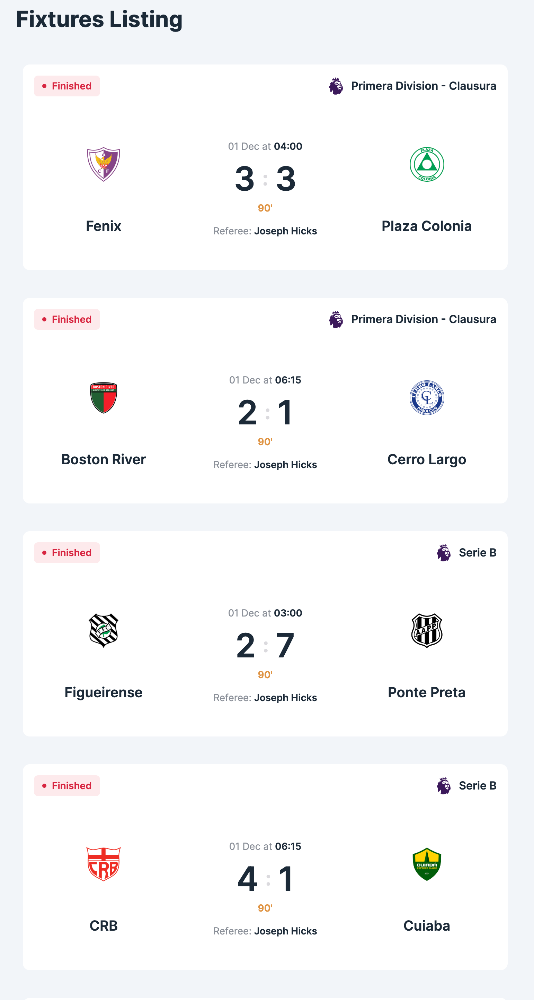
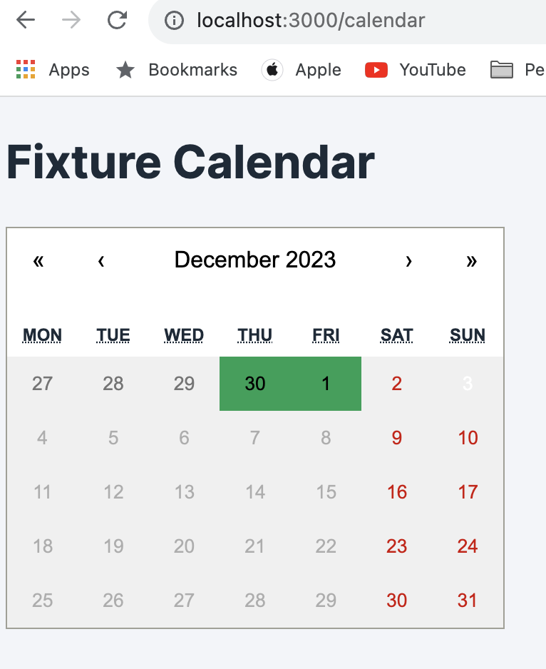

# Fixtures Listing and Calendar React Application

## Description
This React application provides a fixtures listing page and a calendar page to view scheduled fixtures.

The **Fixtures Listing Page** displays a list of upcoming fixtures with team details, match dates, and scores (if available).

The **Calendar Page** presents a calendar UI where users can navigate through months, view fixture dates, and disable inactive dates without fixtures.

## Screenshots




## Table of Contents
- [Installation](#installation)
- [Usage](#usage)
- [Features](#features)

## Installation
To run this application locally, follow these steps:

1. Clone the repository:
    ```bash
    git clone https://github.com/mambaz/fixtures-finder.git
    cd fixtures-finder
    ```

2. Install dependencies:
    ```bash
    npm install
    ```

3. Start the development server:
    ```bash
    npm start
    ```

## Usage
Once the application is running, navigate to the fixtures listing page to view the upcoming fixtures. Use the calendar page to browse fixture dates and navigate through months.

## Features
### Fixtures Listing Page
- Displays a list of upcoming fixtures.
- Includes team details, match dates, and scores (if available).

### Calendar Page
- Provides a calendar UI to navigate through months.
- Displays fixture dates and disables inactive dates without fixtures.

